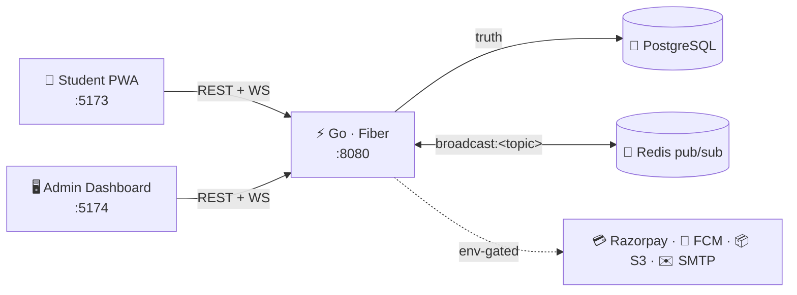

<div align="center">


<br/>


**One app · One identity · One real-time pipe**

*Everything a campus needs — announcements, emergencies, events with paid QR ticketing,
anonymous polls, lost & found, clubs, mess menus — delivered live over WebSocket.*

[Quick Start](#-quick-start) · [Features](#-features) · [Architecture](#-architecture) · [Decision Log](DECISIONS.md) · [API Contract](docs/API_CONTRACT.md)

</div>

---

## ✨ Features

| | Students (mobile PWA · desktop web) | | Admins & Club Accounts |
|---|---|---|---|
| 📣 | Live feed — announcements land in <1s with 👍 reactions | 📊 | Real-time delivery counters (“Delivered 1,204 / 4,000”) |
| 🚨 | Full-screen emergency takeover, ack-tracked | ⏰ | Scheduled publishing + dept / year / club targeting |
| 🎟 | **Paid events → Razorpay → QR ticket in the app** | 📷 | **Door check-in: scan the QR, entry granted exactly once** |
| 🗳 | Anonymous polls — votes stored behind an HMAC, *provably* unlinkable | 🧑‍🤝‍🧑 | Live attendee lists (ticketed / arrived / RSVP) |
| 🔍 | Lost & found with full-text **match alerts** | 🛡 | Moderation queue, audit log, RBAC (5 roles) |
| 🗓 | Real academic calendar + daily mess menu | 📈 | Analytics: signups, reach, poll participation |

<details>
<summary><b>🎬 The ticket flow, end to end</b></summary>

```
club account creates “Fest ₹150”  →  student taps Buy
        →  Razorpay checkout (signature verified server-side, HMAC-SHA256)
        →  QR ticket appears in the app (opaque 32-hex secret)
        →  club account scans it at the door  →  ✓ ENTRY GRANTED
        →  second scan  →  ✕ 409 already checked in (with who & when)
        →  another club scanning it  →  ✕ 403 not your event
```
No Razorpay keys configured? A **mock gateway** completes purchases instantly,
so the whole loop is testable locally with zero setup.
</details>

## 🏗 Architecture



The rules that keep it honest:

- **Postgres is the source of truth; Redis is plumbing.** Flush Redis, lose nothing.
- **WebSocket is an accelerator, not a store** — on reconnect, clients reconcile over REST.
- **Stateless fan-out** — every publish goes through Redis `broadcast:<topic>`, so N backend
  instances behind a load balancer deliver correctly with zero sticky sessions.
- **Anonymity by construction** — poll votes are keyed by `HMAC(poll_id + user_id, secret)`;
  even a DB admin can't join a vote to a person. There's a test that proves it.
- **Everything external is env-gated** — Razorpay, FCM push, S3, SMTP all degrade to
  dev-friendly mocks/logs when unconfigured. `go run` is the whole backend setup.

## 🚀 Quick Start

> Prereqs: Go 1.24+, Node 20+, Docker

```bash
git clone https://github.com/<you>/vit-live && cd vit-live

docker compose up -d postgres redis          # 1 · infra
cd backend && go run ./cmd/server            # 2 · API :8080 (migrates + seeds itself)
cd student-app && npm i && npm run dev       # 3 · student app :5173
cd admin-dashboard && npm i && npm run dev   # 4 · admin :5174
```

| | URL | Login |
|---|---|---|
| 🎓 Student app | http://localhost:5173 | sign up — dev OTP is shown on-screen |
| 🛠 Admin dashboard | http://localhost:5174 | `admin@vit.ac.in` / `admin12345` |

<details>
<summary><b>⚙️ Optional integrations (backend/.env)</b></summary>

```bash
RAZORPAY_KEY_ID=rzp_test_…        # real checkout (else: instant mock gateway)
RAZORPAY_KEY_SECRET=…
FCM_SERVICE_ACCOUNT_JSON=./sa.json # background push (else: logged)
S3_ENDPOINT=… S3_BUCKET=…          # uploads to R2/S3/MinIO (else: local disk)
SMTP_HOST=…                        # real OTP email (else: OTP in response)
```
</details>

## 🧪 Tests & CI

```bash
cd backend && go test ./... -count=1
```

Integration tests boot the **real app in-process** against a disposable database:
full auth flow · RBAC 403s · double-vote 409 · **vote anonymity** · scheduled posts
never leak · ticket purchase → check-in once → cross-club 403. GitHub Actions runs
it all plus lint + typecheck + builds for both frontends on every push.

## 📁 Layout

```
backend/          Go Fiber API · WS hub · Redis bridge · embedded SQL migrations
student-app/      React 19 PWA · Tailwind v4 · Framer Motion · black theme
admin-dashboard/  React admin console · same design language
docs/             PRD · TRD · app flows · API_CONTRACT.md (the shared contract)
DECISIONS.md      why every piece is built the way it is
```

<div align="center">


**Built from spec to shipping — read the [decision log](DECISIONS.md) for the full story.**

</div>
